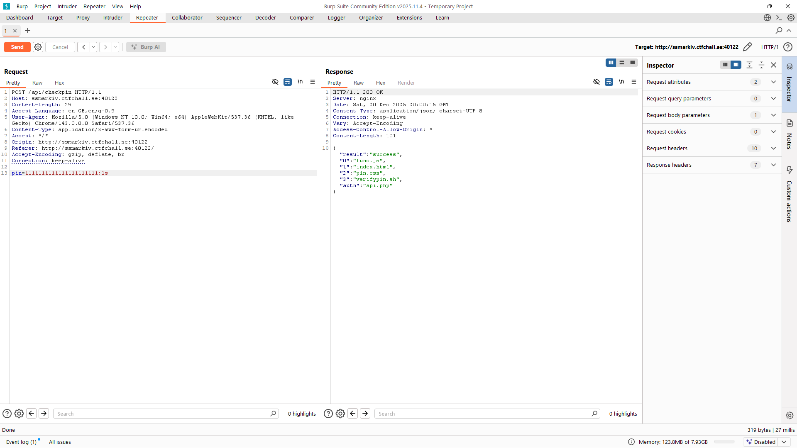
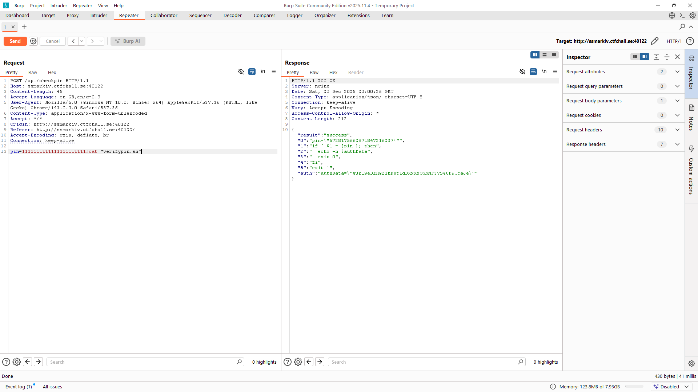

# Write-up of the challenge "Pin 4"

This challenge is part of the "Web" category and is worth 450 points.

# Goal of the challenge

So when we visit the website we are asked to input the correct pincode to get into the vault and find the flag.

## Problem

So my first idea was to use **"burp suite intruder"** to bruteforce the pin code, however I gave up on that when I realized the pincode should be like 23 digits.

## Security breach
So after doing some investigation in burp suite I found that the vulnerability was **"Command injection"**, after a lot of fuzzing tests.

 
## Solution
So after knowing that the bruteforce will take a lot of time I decided to test random common vulnerabilties on the "**endpoint /checkpin**", using burpsuite.
First I tested to send 
```
pin=123;ls
```
and it worked!


After ensuring that the **"Command injection"** worked we went on and read **"verifypin.sh"** and found the pin for the flag!




If you liked this writeup you can star my repository.