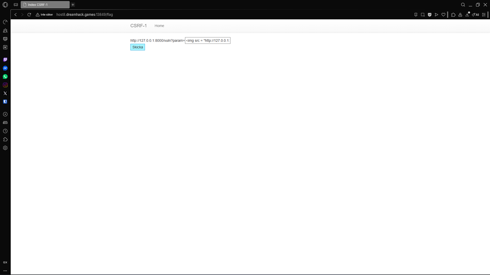
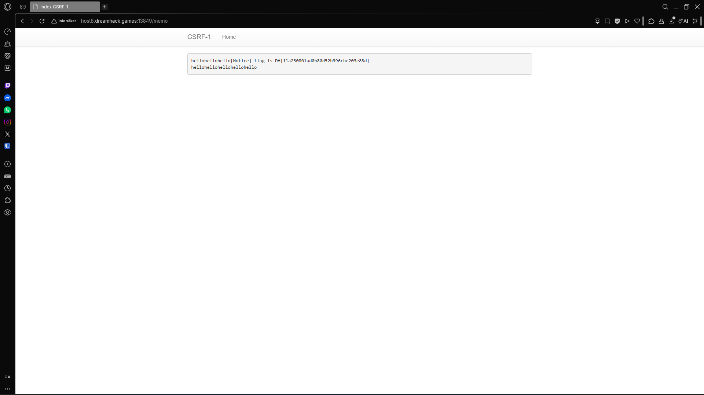

# Write-up of the challenge "csrf-1"

This challenge is part of the "Web" category and is level 1.

## Program structure

```
#!/usr/bin/python3
from flask import Flask, request, render_template
from selenium import webdriver
from selenium.webdriver.chrome.service import Service
import urllib
import os

app = Flask(__name__)
app.secret_key = os.urandom(32)

try:
    FLAG = open("./flag.txt", "r").read()
except:
    FLAG = "[**FLAG**]"


def read_url(url, cookie={"name": "name", "value": "value"}):
    cookie.update({"domain": "127.0.0.1"})
    try:
        service = Service(executable_path="/chromedriver")
        options = webdriver.ChromeOptions()
        for _ in [
            "headless",
            "window-size=1920x1080",
            "disable-gpu",
            "no-sandbox",
            "disable-dev-shm-usage",
        ]:
            options.add_argument(_)
        driver = webdriver.Chrome(service=service, options=options)
        driver.implicitly_wait(3)
        driver.set_page_load_timeout(3)
        driver.get("http://127.0.0.1:8000/")
        driver.add_cookie(cookie)
        driver.get(url)
    except Exception as e:
        driver.quit()
        print(str(e))
        # return str(e)
        return False
    driver.quit()
    return True


def check_csrf(param, cookie={"name": "name", "value": "value"}):
    url = f"http://127.0.0.1:8000/vuln?param={urllib.parse.quote(param)}"
    return read_url(url, cookie)


@app.route("/")
def index():
    return render_template("index.html")


@app.route("/vuln")
def vuln():
    param = request.args.get("param", "").lower()
    xss_filter = ["frame", "script", "on"]
    for _ in xss_filter:
        param = param.replace(_, "*")
    return param


@app.route("/flag", methods=["GET", "POST"])
def flag():
    if request.method == "GET":
        return render_template("flag.html")
    elif request.method == "POST":
        param = request.form.get("param", "")
        if not check_csrf(param):
            return '<script>alert("wrong??");history.go(-1);</script>'

        return '<script>alert("good");history.go(-1);</script>'


memo_text = ""


@app.route("/memo")
def memo():
    global memo_text
    text = request.args.get("memo", None)
    if text:
        memo_text += text
    return render_template("memo.html", memo=memo_text)


@app.route("/admin/notice_flag")
def admin_notice_flag():
    global memo_text
    if request.remote_addr != "127.0.0.1":
        return "Access Denied"
    if request.args.get("userid", "") != "admin":
        return "Access Denied 2"
    memo_text += f"[Notice] flag is {FLAG}\n"
    return "Ok"


app.run(host="0.0.0.0", port=8000)

```

## Vulnerability

Not enough CSRF protection they could have used csrf token for example.

## Solution

So what I did was go to the **/flag** endpoint and there I started my injections. Turns out previously I also faced similiar problem in another CTF challenge so it was easy to solve.

To begin with the problem was that they blocked html elements like **script** and other elements so the only solution I could think of was to send an image instead. The image has **src** attribute where it access it's source file so if we put there the url of our flag then we can get it!

If we look at this endpoint:

```
@app.route("/admin/notice_flag")
def admin_notice_flag():
    global memo_text
    if request.remote_addr != "127.0.0.1":
        return "Access Denied"
    if request.args.get("userid", "") != "admin":
        return "Access Denied 2"
    memo_text += f"[Notice] flag is {FLAG}\n"
    return "Ok"
```

What it does is just check if the request is from **127.0.0.1/admin/notice_flag** with the paramter of **userid** which should be **admin**.

So I combined that with what I explained earlier and made an **CSRF** attack via the **img**:

```

```



and then went to the **/memo** endpoint where it writes out the content!

