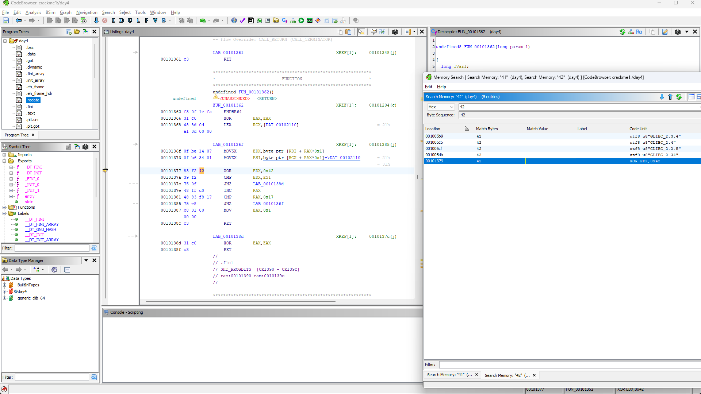
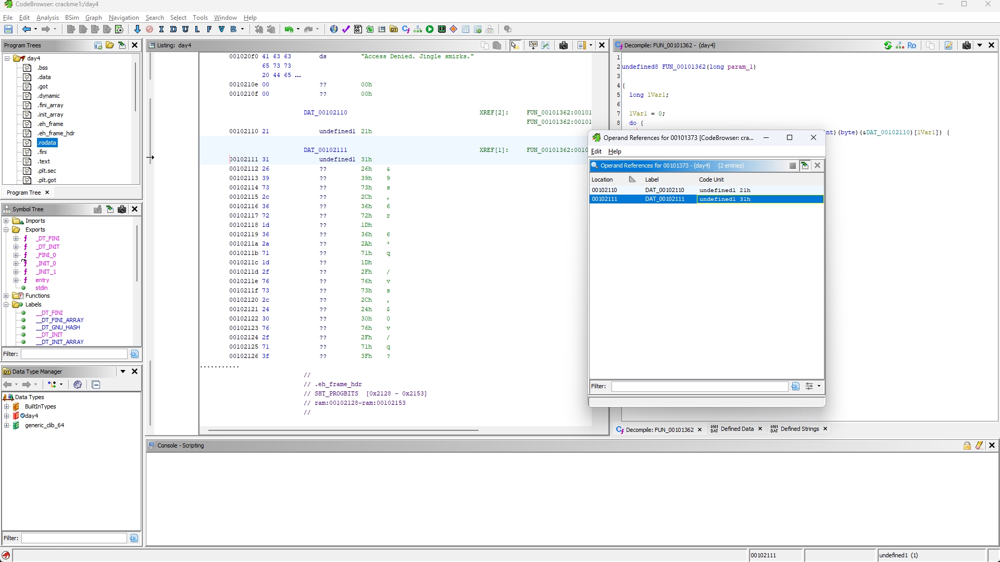

# Write-up of the challenge "The elf's wager"

This challenge is part of the **"Reverse engineering"** category and earns 50 points.

# Goal of the challenge

So the goal of the challenge is to crack the liecence key basically. 

# Program structure (Just the important part)
```c
int64_t sub_401362(void* arg1)
{
    for (int64_t i = 0; i != 0x17; i += 1)
    {
        if ((*(arg1 + i) ^ 0x42) != data_402110[i])
            return 0;
    }
    
    return 1;
}
```

## Solution

I just went into ghidra and found where's the encrypting is happening. To my luck I found the symbol for the data it is used for finding the flag. You can see the image's below:




In the encrypting I found out that they are just looping certain data and then **XORing** which leading to the output. So basically I just reversed that by **Xoring** it again because 
```c
flag ^ 0x42 = result
```
so the flag should be:
```c
result ^ 0x42 = flag
```
Here's my solve.py: 
```python
magic = [
    0x21, 0x31, 0x26, 0x39, 0x73, 0x2c, 0x36, 0x72, 
    0x1d, 0x36, 0x2a, 0x71, 0x1d, 0x2f, 0x76, 0x73, 
    0x2c, 0x24, 0x30, 0x76, 0x2f, 0x71, 0x3f
]

flag = ""
for item in magic:
    flag += chr(item ^ 0x42)

print(flag)
```

